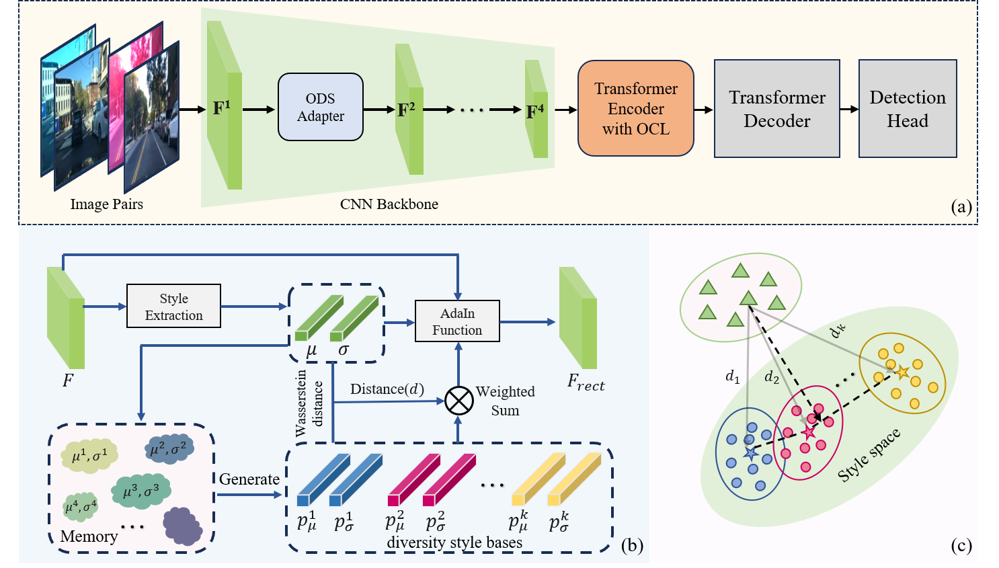

# Style-Adaptive Detection Transformer for Single-Source Domain Generalized Object Detection

**Authors:** Jianhong Han, Liang Chen, and Yupei Wang  
This repository provides the official implementation for our paper:  
**"Style-Adaptive Detection Transformer for Single-Source Domain Generalized Object Detection."**

If you find this project useful for your research, please consider citing our paper:

```bibtex
@article{jianhong2026style,
  title={Style-adaptive detection transformer for single-source domain generalized object detection},
  author={Jianhong, Han and Wang, Yupei and Chen, Liang},
  journal={Neurocomputing},
  pages={133583},
  year={2026},
  publisher={Elsevier}
}
```

<p align="center">
  
</p>

## 🛠️ Acknowledgment
This implementation is built upon [DINO](https://github.com/IDEA-Research/DINO/).

## 🧱 Installation

Please follow the instructions in [requirements.txt](requirements.txt) to set up the environment.  
Our development environment is as follows:

- **OS:** Ubuntu 16.04  
- **Python:** 3.10.9  
- **CUDA:** 11.8  
- **PyTorch:** 2.0.1  
- **torchvision:** 0.15.2  

## 📁 Dataset Preparation

To prepare the datasets, follow these steps:

1. Download datasets from the official sources.
2. Convert the annotation files into **COCO-format**.
3. Modify dataset paths in [`DAcoco.py`](./datasets/DAcoco.py):

```python
def build_dayclear(image_set, args):

    # --- Source domain training set
    PATHS_Source = {
        "train": ("<image_folder>", "<annotation_file>"),
    }

    # --- Augmented domain training set
    PATHS_Target = {
        "train": ("<image_folder>", "<annotation_file>"),

    # --- Source domain test set
        "val": ("<image_folder>", "<annotation_file>"),
    }
  ```
    
4. All available scenes are listed in [`__init__.py`](./datasets/__init__.py).

## 🚀 Training, Evaluation, and Inference

Configuration files are located in the [`config`](config/) directory.

### 🔧 Training

- **Single-GPU Training**
  ```bash
  sh scripts/DINO_train.sh
  ```

### 📊 Evaluation

We provide a script for evaluating pre-trained models.

- `--dataset_file` specifies the test dataset  
- `--resume` specifies the checkpoint path

```bash
sh scripts/DINO_eval.sh
```

### 👁️ Inference

To visualize detection results, use:

```bash
python inference.py
```

Details can be found in [`inference.py`](inference.py).

## 🎯 Pre-trained Models

We provide a pre-trained model and corresponding configuration to facilitate reproducibility:

- 🔧 [Configuration file](config/DINO_4scale.py)  
- 📦 [Pre-trained model (Baidu Drive)](https://pan.baidu.com/s/1flqqA6sEDoY3GEhwt37U_w?pwd=qn9i)


### 📈 Performance (mAP@50)

| Target Domain       | mAP@50 |
|---------------------|--------|
| **Daytime-Clear**   | 64.3%  |
| **Dusk-Rainy**      | 46.5%  |
| **Night-Rainy**     | 24.5%  |
| **Daytime-Foggy**   | 41.7%  |
| **Night-Clear**     | 45.6%  |

## 📚 Reference

Built upon: https://github.com/IDEA-Research/DINO
